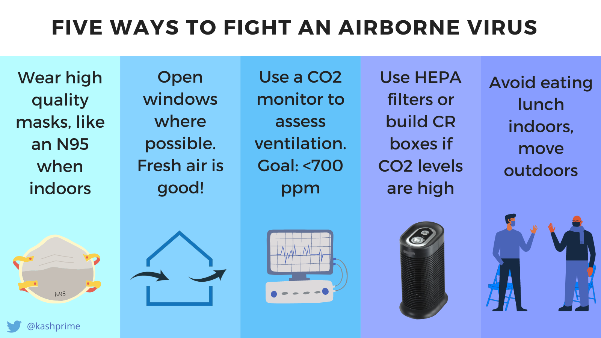
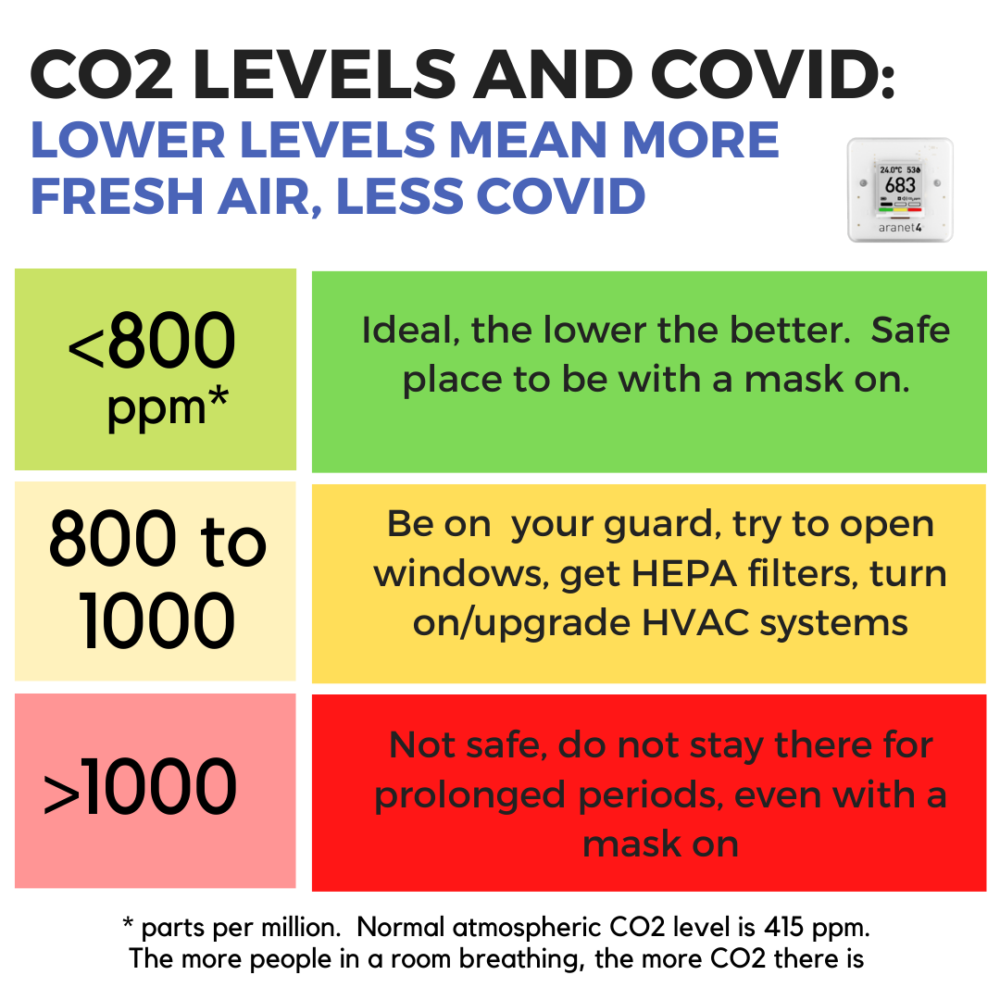

# Infographics
Collection of Open-Sourced Covid Related Infographics created by me.
They are licensed under a Creative Commons Zero license.  Feel free to translate, modify and distribute without any need to attribute to me.
I have included vector (svg) files that should be able to make this process easier. 

You can post CO2 readings in the [Raven CleanAir Map](https://ravenapp.org/cleanair) to share safe spaces with the general public.

